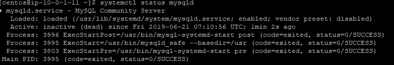

# Centos - Database Server

#### Installation Mysql 

Voici la marche à suivre pour installer Mysql sur Centos 



Un arrêt du service a été effectué pour vérifier le bon fonctionnement de la supervision

Les premières alertes sont bien remontés

Une remontée de mail est effectué également

